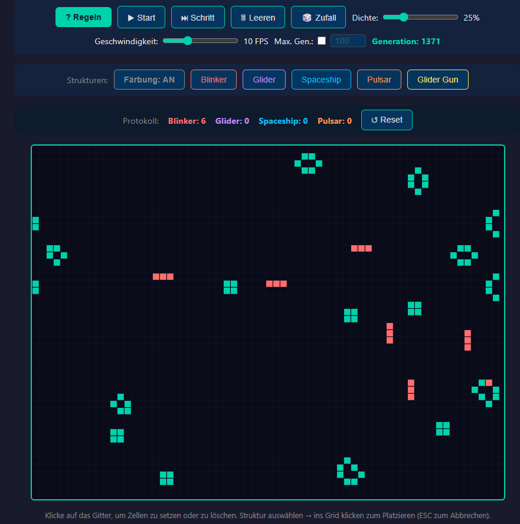

# Conway's Game of Life

A fully interactive, browser-based implementation of **Conway's Game of Life** built with pure Vanilla JavaScript and HTML5 Canvas — no frameworks, no dependencies, no build step required.

🌐 **Live Demo:** [gameoflife.daniel-ertl.de](http://gameoflife.daniel-ertl.de)

---

## Screenshot



---

## Features

### Simulation Controls
| Control | Description |
|---|---|
| **▶ Start / ⏸ Pause** | Starts or pauses the simulation |
| **⏭ Step** | Advances the simulation by exactly one generation |
| **🗑 Clear** | Empties the grid and resets the generation counter |
| **🎲 Random** | Fills the grid with randomly alive cells |
| **Speed slider** | Adjusts simulation speed from 1 to 30 FPS |
| **Density slider** | Controls the percentage of alive cells when using Random (1–100%, default 25%) |
| **Max. Gen.** | Optional generation limit — enable the checkbox and set a number; the simulation auto-pauses when reached (default: unlimited) |
| **Generation counter** | Displays the current generation number |

### Drawing
Click or drag on the canvas to toggle cells on or off. Left-click on a dead cell brings it to life; left-click on a live cell kills it. Dragging paints continuously.

### Preset Structures
Select a structure from the **Structures** bar, then click anywhere on the canvas to place it centered at that position. Press **ESC** or click the active button again to cancel placement.

| Structure | Color | Description |
|---|---|---|
| **Blinker** | 🔴 Red | The simplest oscillator — three cells that alternate between horizontal and vertical (period 2) |
| **Glider** | 🟣 Purple | A classic spaceship that travels diagonally across the grid (period 4) |
| **Spaceship** | 🔵 Blue | Lightweight Spaceship (LWSS) — moves horizontally (period 4) |
| **Pulsar** | 🟠 Orange | A large, symmetric oscillator with a period of 3 |
| **Glider Gun** | 🟡 Yellow | Gosper's Glider Gun — a stationary structure that continuously emits Gliders |

### Structure Coloring
Known structures are automatically detected every generation and highlighted in their respective colors. The detection uses an **isolation check**: a pattern is only recognized as a known structure if all surrounding cells are dead, preventing false positives within larger formations.

> **Note:** The Glider Gun is not auto-detected. With a period of 30 and 36 cells, full detection would require 240 pattern variants (30 phases × 8 symmetries), which would significantly slow down the simulation. The Gun is highlighted only when manually placed via the button.

The **Coloring: ON/OFF** toggle in the Structures bar switches all structure highlighting on or off instantly.

### Structure Log (Protocol)
The **Protocol** bar tracks how many times each known structure has newly appeared during the current run:

- **New instance detection** uses centroid-matching between generations: if the center of a detected structure is more than 5 cells away from any previously known instance of the same type, it is counted as a new occurrence.
- This correctly handles oscillators (e.g., a Blinker's centroid stays fixed even as its cells alternate) and moving structures (e.g., Gliders from a Gun are each counted once as they travel away).
- The counter resets automatically on **Clear** and **Random**, or manually via the **↺ Reset** button.

### Rules Dialog
Click **? Rules** to open a modal explaining the four rules of Conway's Game of Life, with a link to the Wikipedia article.

---

## Rules of the Game

Every cell interacts with its eight neighbors. In each generation, the following rules apply simultaneously:

1. **Underpopulation** — A live cell with fewer than 2 live neighbors dies.
2. **Survival** — A live cell with 2 or 3 live neighbors lives on.
3. **Overpopulation** — A live cell with more than 3 live neighbors dies.
4. **Reproduction** — A dead cell with exactly 3 live neighbors becomes alive.

---

## Getting Started

No installation or build step needed. Simply open `index.html` in any modern browser:

```bash
# Clone the repository
git clone https://github.com/thunder312/GameOfLife.git
cd GameOfLife

# Open directly (macOS)
open index.html

# Open directly (Linux)
xdg-open index.html

# Or serve locally
python -m http.server 8000
# → http://localhost:8000
```

---

## Project Structure

```
GameOfLife/
├── index.html   # Layout and UI markup
├── style.css    # Dark-theme styling
├── game.js      # All game logic, pattern detection, and event handling
└── gui.png      # UI screenshot
```

---

## Technical Highlights

- **Pattern detection** — All detectable structures (Blinker, Glider, LWSS, Pulsar) are pre-computed at startup: for each structure, all temporal phases are simulated and all rotations/reflections are generated, resulting in a complete set of pattern variants checked every generation.
- **Isolation check** — Each candidate match verifies that the surrounding border cells are all dead, ensuring correct identification within complex grids.
- **Centroid tracking** — New structure instances are identified by comparing their geometric center with known positions from the previous generation, tolerating the cell shifts caused by oscillation and movement.
- **Toroidal grid** — The simulation wraps around at the edges (cells on the right border are neighbors of cells on the left border, and vice versa).

---

## License

MIT
